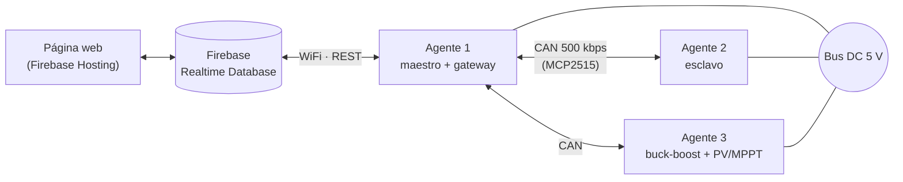

# Capstone 2026 — Microrred DC

Firmware y plataforma web de supervisión para una **microrred DC de 5 V con tres agentes**. Cada agente es un ESP32 (Adafruit Feather ESP32) que controla un conversor buck‑boost bidireccional entre su batería y el bus común. Los agentes se coordinan por **CAN** y se supervisan desde una página web conectada a **Firebase Realtime Database**.

## Equipo

- Sebastián Cornejo
- Samuel Rodríguez
- Diego Enríquez

## Arquitectura



- **Agente 1 (maestro):** regula el voltaje del bus, difunde la referencia de corriente al resto de los agentes y hace de puente (gateway) entre Firebase y la red CAN.
- **Agentes 2 y 3 (esclavos):** no usan WiFi. Envían su telemetría (`v_bat`, `v_bus`, `i_out`, SoC, fallas) por CAN y reciben por el mismo bus los parámetros que se configuran en la web.
- **Agente 3:** además del buck‑boost con baterías 2S, tiene un boost desde panel fotovoltaico con seguimiento del punto de máxima potencia (MPPT).

### Esquema de control

```
Lazo externo → PI de voltaje (V_ref − v_bus)   → i_ref_v
Droop        → kd · (SoC − 0.5)                → i_ref_d
i_ref        = i_ref_v + i_ref_d
Lazo interno → PI de corriente (i_ref − i_out) → duty
Topología    → BOOST si i_ref > 0 (batería → bus), BUCK si i_ref < 0 (bus → batería)
```

El firmware usa los dos núcleos del ESP32:

- **Core 1:** sensores, lazos de control y PWM.
- **Core 0:** comunicaciones (WiFi/Firebase y CAN).

Las mediciones se hacen con un ADS1115 por I2C: voltajes mediante divisores y corriente con un ACS712.

## Estructura del repositorio

| Carpeta / archivo | Descripción |
|---|---|
| `Control_Droop_Agente_1/` | **Versión actual.** Agente 1 maestro droop: control + WiFi/Firebase + gateway CAN. |
| `Control_Droop_Agente_2/` | **Versión actual.** Agente 2 esclavo droop (solo CAN). |
| `Control_Droop_Agente_3/` | **Versión actual.** Agente 3 esclavo droop: buck‑boost + boost PV/MPPT, configuración por CAN guardada en NVS. |
| `Control_Corriente/` | Agente 1 con control de corriente y Firebase, sin CAN. |
| `Control_Corriente_CAN/` | Agente 1 con control de corriente y gateway CAN. |
| `Control_Agente_2/` | Agente 2 con control de corriente, nodo CAN. |
| `buckboost_agente3_pio/` | Firmware integrado del agente 3 para pruebas (ver su [README](buckboost_agente3_pio/README.md)). |
| `Dashboard/` | Primer nodo de prueba: buck‑boost FF+PI + CAN + Firebase. Incluye [CONEXIONES.md](Dashboard/CONEXIONES.md) con el cableado de ADS1115, MCP2515 y PWM. |
| `Agente_1/` | Código de prueba inicial que envía datos simulados a Firebase. |
| `can_web.cpp` | Prueba de CAN: nodo que simula al agente 2. |
| `public/` | Página web de supervisión y control (Firebase Hosting). |
| `database.rules.json` | Reglas de seguridad de la Realtime Database. |
| `firebase.json`, `.firebaserc` | Configuración de Firebase (proyecto `microred-dc`). |

### Páginas web (`public/`)

| Página | Uso |
|---|---|
| `index.html` | Supervisión general de la microrred. |
| `corriente.html` | Control de corriente del agente 1. |
| `control.html` | Sala de control del buck‑boost. |
| `control_can.html` | Control multiagente por CAN. |
| `Configuracion_Agente_3.html` | Configuración del agente 3 (buck‑boost + PV/MPPT). |

## Requisitos

- [VS Code](https://code.visualstudio.com/) con la extensión [PlatformIO](https://platformio.org/).
- Placa Adafruit Feather ESP32 (`board = featheresp32`, framework Arduino).
- Librería `bblanchon/ArduinoJson@^6.21.5`. PlatformIO la instala automáticamente.
- Para la web: [Firebase CLI](https://firebase.google.com/docs/cli) (`npm install -g firebase-tools`).

## Puesta en marcha

### 1. Credenciales

Las credenciales de WiFi y Firebase **no están en el repositorio**. En cada proyecto de firmware que las usa, copia la plantilla y completa tus datos:

```bash
cp Control_Droop_Agente_1/src/secrets.example.h Control_Droop_Agente_1/src/secrets.h
```

`secrets.h` define `WIFI_SSID`, `WIFI_PASS`, `FIREBASE_EMAIL` y `FIREBASE_PASS_FB` (en `Agente_1/` la última se llama `FIREBASE_PASS`), y está incluido en `.gitignore`.

### 2. Compilar y cargar el firmware

Abre la carpeta del agente en VS Code con PlatformIO, o usa la terminal:

```bash
cd Control_Droop_Agente_1
```
```bash
pio run -t upload
```
```bash
pio device monitor -b 115200
```

### 3. Desplegar la web y las reglas de la base de datos

```bash
firebase deploy --only hosting,database
```

## Seguridad

- Al arrancar, el firmware deja siempre el medio puente en estado seguro (`pwmForceSafe()`), antes de cualquier otra inicialización.
- La `apiKey` que aparece en `public/*.html` es una clave pública de cliente de Firebase. El acceso a los datos lo controlan las reglas de `database.rules.json`.
