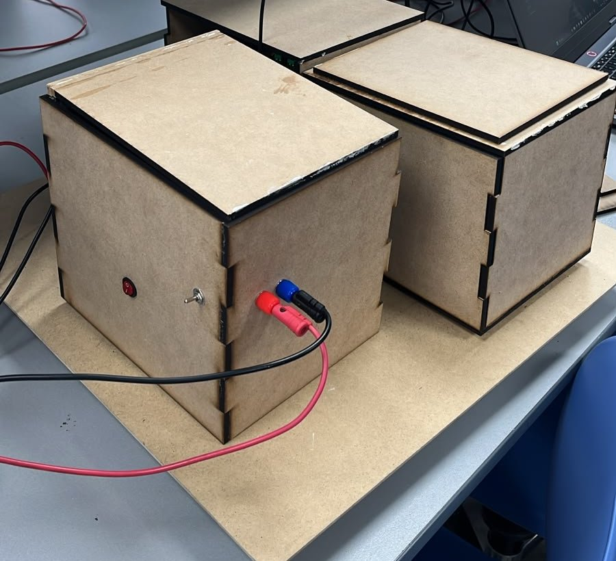
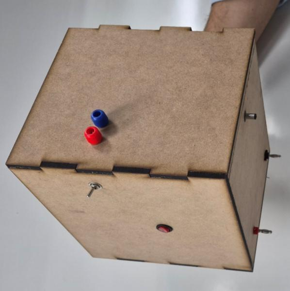
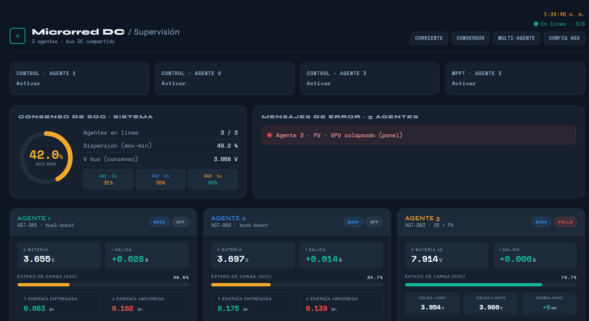
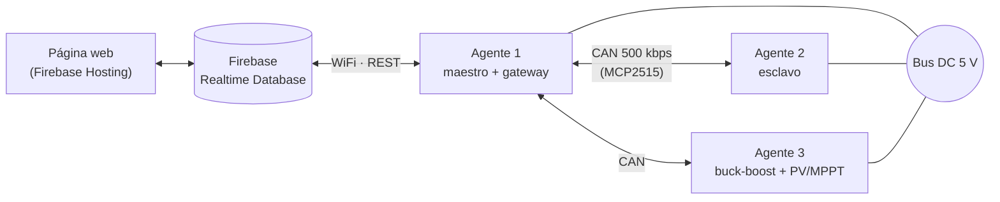

# Capstone 2026 — Microrred DC

Firmware y plataforma web de supervisión para una **microrred DC de 5 V con tres agentes**. Cada agente es un ESP32 (Adafruit Feather ESP32) que controla un conversor buck‑boost bidireccional entre su batería y el bus común. Los agentes se coordinan por **CAN** y se supervisan desde una página web conectada a **Firebase Realtime Database**.

## Curso

| | |
|---|---|
| **Curso** | IEE2913 — Diseño Eléctrico (Capstone) |
| **Institución** | Pontificia Universidad Católica de Chile · Escuela de Ingeniería · Departamento de Ingeniería Eléctrica |
| **Semestre** | 2026‑1 |
| **Profesores** | Saúl Langarica (profesor a cargo del curso) · Cristián Garcés · Tito Arévalo. Los tres apoyaron y evaluaron el proyecto. |
| **Ayudante guía** | Iñaki Gacitúa |
| **Área / proyecto** | Energía — Micro‑red DC |
| **Grupo** | 03 |

## Equipo

- Sebastián Cornejo
- Samuel Rodríguez
- Diego Enríquez

## El proyecto

Las redes eléctricas modernas deben responder a una demanda creciente, con más fuentes renovables, más cargas electrónicas y mayor exposición a eventos extremos. Las **microrredes DC** integran de forma natural fuentes renovables, almacenamiento y cargas DC, con menos etapas de conversión y mayor eficiencia.

El proyecto consiste en diseñar y construir una **microrred de 5 V**, el mismo voltaje que entrega un cargador USB. La forman **tres agentes autónomos y cooperativos** que se reparten la entrega de energía según la carga de sus baterías y mantienen el bus estable aunque cambie el consumo. También siguen operando si alguno de ellos se desconecta.

| Agente | Fuente de energía | Rol |
|---|---|---|
| **Agente 1** | Batería Li‑ion (9600 mAh) | Maestro del control secundario y puente WiFi/Firebase ↔ CAN |
| **Agente 2** | Batería Li‑ion (9600 mAh) | Esclavo por CAN |
| **Agente 3** | 2 baterías Li‑ion en serie (4800 mAh c/u) + panel fotovoltaico | Esclavo por CAN, con boost PV y MPPT |

### Prototipo

<p align="center">
  
  
</p>
<p align="center"><em>Izquierda: los tres agentes sobre la base de conexión. Derecha: el agente 3.</em></p>

Cada agente va en su propia caja, con un interruptor de encendido y bornes de conexión al bus. La base tiene un puerto asignado a cada agente para que no se puedan conectar mal. Para operar el sistema se enciende el agente 1, que se conecta por WiFi al dashboard, y luego cualquier otro agente.

### Dashboard

<p align="center">
  
</p>

En la parte superior hay botones para activar el control de cada agente y el MPPT del agente 3. El control solo arranca si el agente está conectado, encendido y sin fallas. Debajo se muestran el consenso de SoC del sistema, los mensajes de falla y, para cada agente, su estado (ON, OFF, FALLA o SIN CONEXIÓN), el voltaje de batería, la corriente de salida y la energía entregada y absorbida.

### Especificaciones y cumplimiento

Resultados reportados en el informe final del grupo:

| Especificación | Cumplimiento | Implementación |
|---|:---:|---|
| Tres agentes DC‑DC autónomos y cooperativos | 100 % | Dos agentes con batería y un tercero con baterías 2S y panel fotovoltaico |
| Regulación del bus en 5 V | 95 % | Bus estable ante cambios de carga; transitorios de ±1 V durante ~750 ms al cambiar entre buck y boost |
| Control primario *droop* | 100 % | `I_droop = k_droop · (SoC − 50 %)` |
| Control secundario suave | 100 % | PI de voltaje en cascada con PI de corriente |
| Comunicación CAN | 100 % | MCP2515 + TJA1050, recepción por interrupción, matriz CAN con prioridades |
| Estado de carga (SoC) y consenso | 100 % | Tabla de consulta (LUT) de la curva Li‑ion y consenso distribuido del sistema |
| *Dashboard* de supervisión | 100 % | Web en Firebase: SoC, voltajes, corrientes, *smart metering*, fallas y configuración |
| MPPT en el agente fotovoltaico | 100 % | Algoritmo *Perturb & Observe* con límites de corriente y voltaje de batería |
| Gestión de baterías (BMS) | 100 % | Protecciones por software y BMS pasivo por hardware (TL431) en el agente 3 |
| Aislación galvánica control/potencia | 100 % | Optoacopladores 6N137 (PWM), ISO1540 (I2C), fuente aislada B0505S |
| Protecciones y manejo de fallas | 100 % | Fusibles, sobrevoltaje/subvoltaje, sobrecorriente, desconexión por ausencia de CAN (5 s) |

Otros resultados: tiempo de respuesta del bus de unos 2 s y eficiencia de los conversores de ~65–78 % en la mayor parte del rango de operación.

### Matriz CAN

| Prioridad | Clase | ID base | Contenido | Periodo |
|:---:|---|---|---|---|
| 1 | FAULT | `0x0__` | Códigos de falla (sobrecorriente, sobrevoltaje, desconexión) | Por evento |
| 2 | HIGH | `0x1__` | `i_out`, `i_ref`, `v_cons`, `v_bus_real` | 30 / 50 / 150 ms |
| 3 | LOW | `0x2__` | SoC, `v_bus`, estado, *smart metering* | ~1000 ms |
| 4 | CONFIG | `0x4__` | Parámetros enviados desde la web (Firebase → CAN) | Al cambiar un parámetro |

## Arquitectura



- **Agente 1 (maestro):** regula el voltaje del bus, difunde la referencia de corriente al resto de los agentes y hace de puente (gateway) entre Firebase y la red CAN.
- **Agentes 2 y 3 (esclavos):** no usan WiFi. Envían su telemetría (`v_bat`, `v_bus`, `i_out`, SoC, fallas) por CAN y reciben por el mismo bus los parámetros que se configuran en la web.
- **Agente 3:** además del buck‑boost con baterías 2S, tiene un boost desde panel fotovoltaico con seguimiento del punto de máxima potencia (MPPT).

### Esquema de control

```
Lazo externo → PI de voltaje (V_ref − v_bus)   → i_ref_v
Droop        → kd · (SoC − 0.5)                → i_ref_d
i_ref        = i_ref_v + i_ref_d
Lazo interno → PI de corriente (i_ref − i_out) → duty
Topología    → BOOST si i_ref > 0 (batería → bus), BUCK si i_ref < 0 (bus → batería)
```

El firmware usa los dos núcleos del ESP32:

- **Core 1:** sensores, lazos de control y PWM.
- **Core 0:** comunicaciones (WiFi/Firebase y CAN).

Las mediciones se hacen con un ADS1115 por I2C: voltajes mediante divisores y corriente con un ACS712.

## Estructura del repositorio

| Carpeta / archivo | Descripción |
|---|---|
| `Control_Droop_Agente_1/` | **Versión actual.** Agente 1 maestro droop: control + WiFi/Firebase + gateway CAN. |
| `Control_Droop_Agente_2/` | **Versión actual.** Agente 2 esclavo droop (solo CAN). |
| `Control_Droop_Agente_3/` | **Versión actual.** Agente 3 esclavo droop: buck‑boost + boost PV/MPPT, configuración por CAN guardada en NVS. |
| `Control_Corriente/` | Agente 1 con control de corriente y Firebase, sin CAN. |
| `Control_Corriente_CAN/` | Agente 1 con control de corriente y gateway CAN. |
| `Control_Agente_2/` | Agente 2 con control de corriente, nodo CAN. |
| `buckboost_agente3_pio/` | Firmware integrado del agente 3 para pruebas (ver su [README](buckboost_agente3_pio/README.md)). |
| `Dashboard/` | Primer nodo de prueba: buck‑boost FF+PI + CAN + Firebase. Incluye [CONEXIONES.md](Dashboard/CONEXIONES.md) con el cableado de ADS1115, MCP2515 y PWM. |
| `Agente_1/` | Código de prueba inicial que envía datos simulados a Firebase. |
| `can_web.cpp` | Prueba de CAN: nodo que simula al agente 2. |
| `public/` | Página web de supervisión y control (Firebase Hosting). |
| `database.rules.json` | Reglas de seguridad de la Realtime Database. |
| `firebase.json`, `.firebaserc` | Configuración de Firebase (proyecto `microred-dc`). |

### Páginas web (`public/`)

| Página | Uso |
|---|---|
| `index.html` | Supervisión general de la microrred. |
| `corriente.html` | Control de corriente del agente 1. |
| `control.html` | Sala de control del buck‑boost. |
| `control_can.html` | Control multiagente por CAN. |
| `Configuracion_Agente_3.html` | Configuración del agente 3 (buck‑boost + PV/MPPT). |

## Requisitos

- [VS Code](https://code.visualstudio.com/) con la extensión [PlatformIO](https://platformio.org/).
- Placa Adafruit Feather ESP32 (`board = featheresp32`, framework Arduino).
- Librería `bblanchon/ArduinoJson@^6.21.5`. PlatformIO la instala automáticamente.
- Para la web: [Firebase CLI](https://firebase.google.com/docs/cli) (`npm install -g firebase-tools`).

## Puesta en marcha

### 1. Credenciales

Las credenciales de WiFi y Firebase **no están en el repositorio**. En cada proyecto de firmware que las usa, copia la plantilla y completa tus datos:

```bash
cp Control_Droop_Agente_1/src/secrets.example.h Control_Droop_Agente_1/src/secrets.h
```

`secrets.h` define `WIFI_SSID`, `WIFI_PASS`, `FIREBASE_EMAIL` y `FIREBASE_PASS_FB` (en `Agente_1/` la última se llama `FIREBASE_PASS`), y está incluido en `.gitignore`.

### 2. Compilar y cargar el firmware

Abre la carpeta del agente en VS Code con PlatformIO, o usa la terminal:

```bash
cd Control_Droop_Agente_1
```
```bash
pio run -t upload
```
```bash
pio device monitor -b 115200
```

### 3. Desplegar la web y las reglas de la base de datos

```bash
firebase deploy --only hosting,database
```

## Seguridad

- **La web es pública solo para mirar.** Cualquiera puede ver la telemetría y los parámetros, pero para enviar comandos hay que iniciar sesión (botón abajo a la derecha) con una cuenta del equipo.
- **Los permisos de escritura se asignan por UID** en la Realtime Database y solo se editan desde la consola de Firebase:
  - `/usuarios/<uid>: true`: cuentas del equipo, que pueden modificar `agenteN/params` y `conversor/params`.
  - `/dispositivos/<uid>: true`: cuenta del ESP32 gateway, que puede escribir telemetría, `agentes`, `history`, `loghf`, `consenso` y `sistema`.
- **Las reglas limitan los parámetros críticos** (voltaje objetivo, umbrales de protección y límites de corriente) a rangos seguros. El firmware aplica los mismos límites.
- Al arrancar, el firmware deja siempre el medio puente en estado seguro (`pwmForceSafe()`), antes de cualquier otra inicialización.
- La `apiKey` que aparece en `public/*.html` es una clave pública de cliente de Firebase. El acceso a los datos lo controlan las reglas de `database.rules.json`.
